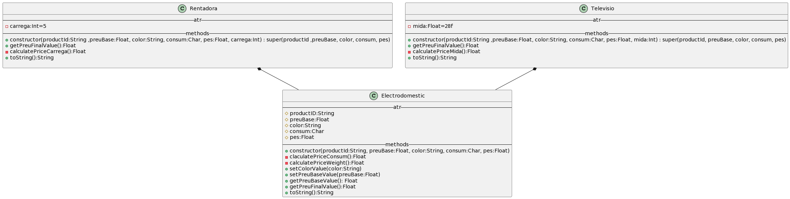

# OOP Kotlin Activities 🚀

Compilation of basic exercices on Kotlin using object oriented programation. 

## Index

1. [File Structure](#File-Structure)
2. [Activitat 4](#Activitat-4)
3. [Activitat 6](#Activitat-6)
4. [Activitat 7](#Activitat-7)
5. [Activitat 8](#Activitat-8)

## File Structure

The structure of the project is divided in 3 packages: Executions, Models and Utilities.
- [Executions](src/main/kotlin/Executions): contains main() with menu to each single activity execution, and the respective executions.
- [Models](src/main/kotlin/Models): contains all the classes.
- [Utilities](src/main/kotlin/Utilities): contains a utilities library and a console colors library.

##Activitat 4

This activity has the next files: 
- [MainPersona.kt](src/main/kotlin/Executions/MainPersona.kt) 
- [MainCercle.kt](src/main/kotlin/Executions/MainCercle.kt) 
- [Persona.kt](src/main/kotlin/Models/Persona.kt) 
- [Cercle.kt](src/main/kotlin/Models/Cercle.kt) 

##Activitat 6

This activity has the next files: 
- [MainPasta.kt](src/main/kotlin/Executions/MainPasta.kt) 
- [MainBeguda.kt](src/main/kotlin/Executions/MainBeguda.kt)
- [Pasta.kt](src/main/kotlin/Models/Pasta.kt) 
- [Beguda.kt](src/main/kotlin/Models/Beguda.kt) 

##Activitat 7

This activity has the next files: 
- [MainLamp.kt](src/main/kotlin/Executions/MainLamp.kt) 
- [Lamp.kt](src/main/kotlin/Models/Lamp.kt) 

##Activitat 8

This activity has the next files: 
- [MainElectrodomestics.kt](src/main/kotlin/Executions/MainElectrodomestics.kt) 
- [Electrodomestic.kt](src/main/kotlin/Models/Electrodomestic.kt) 
- [Rentadora.kt](src/main/kotlin/Models/Rentadora.kt) 
- [Televisio.kt](src/main/kotlin/Models/Televisio.kt) 

This is the UML class diagram for this activity: 

---

- Autora:Anna Cano
- Data: 11/01/24

